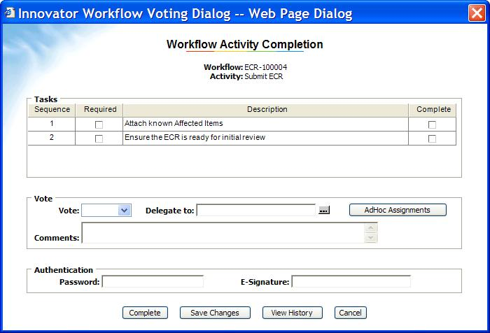

# AdHoc Workflow Dialog

Modifies the standard Workflow Voting dialog, by adding an AdHoc button. This allows the assignee of an Activity to create some adHoc activities, to ask for help, before deciding how to vote on the currently assigned Activity.

The added AdHoc Activities are placed into a separate Workflow Process. The new workflow sends emails to the selected new Assignees, and after their work is done, the workflow returns to the originator.

After reading the comments from the adHoc assignees, the original assignees can then open the original Activity and complete it.

Future ideas: Option on the dialog to put the adHoc activities into the same Workflow process so that the AdHoc votes are recorded and archived along with the original Workflow activities.

## History

This project and the following release notes have been migrated from the old Aras Projects page. Unlike community projects that have been migrated and archived, this project will be updated for compatibility with the latest release of Aras Innovator.

Release | Notes
--------|--------
[v8.0.0](https://github.com/ArasLabs/adhoc-workflow-dialog/releases/tag/v8.0.0) | Initial release, based on code Terry Stickel did for Varian Semiconductor. The orignal solution was for Innovator 6.1. here it is updated for 8.0.0 and 8.1.1. Note there is a package with 2 Email items to Import, and one replacement HTML file for the Innovator code tree.

#### Supported Aras Versions

Project | Aras
--------|------
[v8.0.0](https://github.com/ArasLabs/adhoc-workflow-dialog/releases/tag/v8.0.0) | 8.0.0

## Installation

#### Important!
**Always back up your code tree and database before applying an import package or code tree patch!**

### Pre-requisites

1. Aras Innovator installed
2. Aras Package Import tool
3. **workflowAdHoc** import package
4. adhoc-workflow-dialog code tree overlay

### Install Steps

1. Backup your code tree and store the backup in a safe place.
2. Copy the Innovator folder from the project's CodeTree subdirectory.
3. Paste the Innovator folder into the root directory of your Aras installation.
  * Tip: This is the same directory that contains the InnovatorServerConfig.xml file.
4. Backup your database and store the BAK file in a safe place.
5. Open up the Aras Package Import tool.
6. Enter your login credentials and click **Login**
  * _Note: You must login as root for the package import to succeed!_
7. Enter the package name in the TargetRelease field.
  * Optional: Enter a description in the Description field.
8. Enter the path to your local `..\adhoc-workflow-dialog\Import\ITIL.mf` file in the Manifest File field.
9. Select **workflowAdHoc** in the Available for Import field.
10. Select Type = **Merge** and Mode = **Thorough Mode**.
11. Click **Import** in the top left corner.
12. Close the Aras Package Import tool.

## Usage

See [the original readme](./Documentation/README.TXT) for more information on using this project.

## Contributing

1. Fork it!
2. Create your feature branch: `git checkout -b my-new-feature`
3. Commit your changes: `git commit -am 'Add some feature'`
4. Push to the branch: `git push origin my-new-feature`
5. Submit a pull request

For more information on contributing to this project, another Aras Labs project, or any Aras Community project, shoot us an email at araslabs@aras.com.

## Credits

Created by Peter Schroer, Aras Corporation.

## License

Aras Labs projects are published to Github under the MIT license. See the [LICENSE file](./LICENSE.md) for license rights and limitations.
